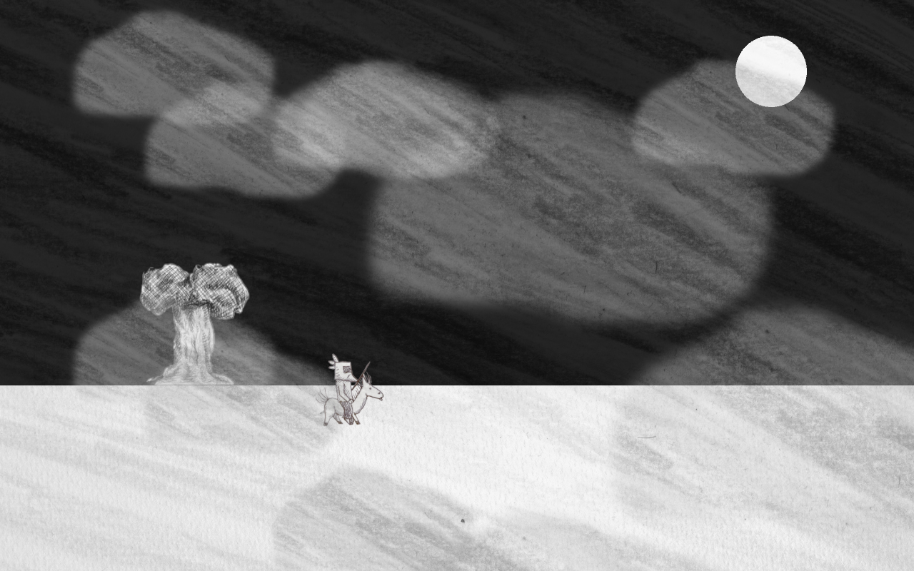
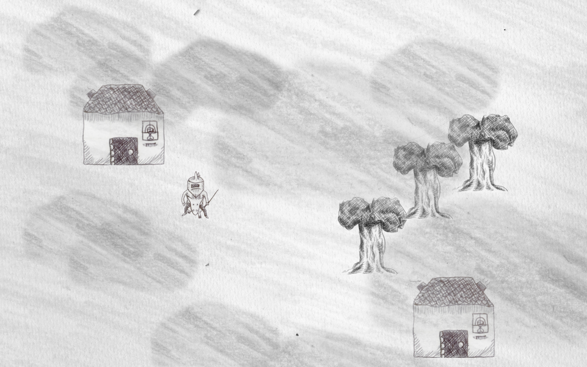

#Borne to Burn (en travaux)
Installation vidéographique interactive.

#Hein?
Cheval et Chevalier est une installation vidéo-graphique, narrative et interactive (un jeu vidéo quoi). Voici l'histoire:
Arrivés dans un monde embrumé, Cheval et Chevalier doivent chercher d'ou vient ce mystérieux brouillard (ça leur permettra de faire une traditionnelle quête après tout). Mais petit à petit, le monde semble se métamorphoser, comme si il s'évanouissait…

### EN priorité
• Introduction (voix + animation).
• Tests Son Sampler auto
• Test Visage de la Fin

##1. Le monde virtuel apparait.
##2. Le monde virtuel dévoré progressivement par des éléments du réel qui viennent s'y greffer.
##3. Sortie (ou non) du virtuel, par la destruction de sa propre figure (celle du joueur) représentée dans le jeu.

**Ce projet vous est présenté par Sieur Géroux (Scénario & Graphisme) et Sieur Nioudélit (Graphisme, Programmation).**

## NOTES à ma propre attention
"Borne to Burn" (nom non-defititif) est un projet d'installation vidéo-interactive.
ludique immersive et merveilleuse. 

Intrusion progrogressive du réel dans le monde virtuel (bande son, images, jusqu'à l'apparition de la figure du joueur)

Merveilleux ---> Projection. Une image. Un mirage. Une illusiion. 

Immersion. (Entree) Appréhension du dispositif, Mise en place de l'univers'
Bain. (lecture et participation au récit interactif)
Désillusion. (Sortie, retour au réel, fin de la saisie)

L'interface obsolète, hyperi'

La fin de l'illustion.

confiscation

Jean Louis Boissier
Jean Louis Weissberg
Fred Périé
Pierrick Sorin
Dorian / USUL
Vincent Morisset
Chris Marker (IMmeory)
Ari Folmann
Dan Graham (tentative de saisir  sa propre image)

illusion de réciprocité

Jeu vidéo ou Art numérique?
--> on s'en fout dans l'absolu
frontière ténue

jeu vidéo serait = à mécanismes ludiques (design)
art numérique = expérience interactive (sans gagner ou perdre) "interactvité pure" (art)

(pas convaincu)

http://www.nesblog.com/linteractivite-dans-les-oeuvres-dart-au-xx/
http://hypermedia.univ-paris8.fr/Weissberg/presence/presence.htm#table

7"30
œuvre langage
trinité de l'œuvre
conception (le public pensé)
penser l'œuvre (prend forme)
reception œuvre

interaction des médias entre eux

support 
temps réel

cent milliard de poème hasard

